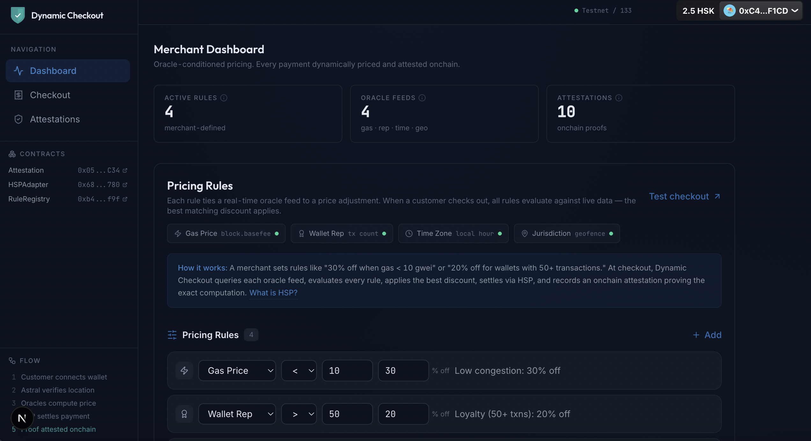

# Dynamic Checkout

> Oracle-conditioned payment middleware on HashKey Chain. Every price is dynamic. Every price is provable.



**Live demo:** [dynamic-checkout-mu.vercel.app](https://dynamic-checkout-mu.vercel.app)

---

## What it does

Merchants define pricing rules tied to real-world data feeds. When a customer pays, Dynamic Checkout:

1. **Queries 4 oracle feeds** — gas price, wallet reputation, local time, jurisdiction
2. **Evaluates all merchant rules** — finds the best matching discount
3. **Settles via HSP** — USDC payment on HashKey Chain
4. **Attests the price onchain** — permanent proof of why the price was what it was

A merchant offering cross-border payments sets a loyalty rule: 20% discount for wallets with 50+ transactions. A returning customer pays $8 instead of $10 — and the onchain attestation records the exact rule that matched, the oracle value (67 txns), and how the final price was derived. Verifiable by anyone, permanently.

## Track

**PayFi** — HashKey Chain Horizon Hackathon

## How it works

```
Connect wallet → Verify location (Astral Protocol) → Oracle feeds evaluate
→ Best discount applied → Pay via HSP → Price proof attested onchain
```

### Oracle Feeds

| Feed | Source | Example Rule |
|------|--------|-------------|
| **Gas Price** | `block.basefee` | < 10 gwei → 30% off |
| **Wallet Reputation** | Transaction count | > 50 txns → 20% off |
| **Time of Day** | Local hour via Astral location | Midnight-6am → 50% off |
| **Jurisdiction** | Astral Protocol geofence | Hong Kong → 10% off |

### HSP Integration

Dynamic Checkout uses the HashKey Settlement Protocol with two authentication layers:

- **HMAC-SHA256** on every request (method, path, body hash, timestamp, nonce)
- **ES256K JWT** for merchant authorization (secp256k1 signature over cart hash)

Payments settle in USDC on HashKey Chain. The HSP client uses Node's built-in `crypto` module for both auth layers — no external JWT library needed.

### Astral Protocol on HashKey Chain

EAS is pre-deployed on HashKey Chain (OP Stack predeploy at `0x4200...0021`). We registered the [Astral location schema](https://docs.astral.global) natively on chain 133, enabling cryptographic location proofs without chain workarounds.

## Deployed Contracts

HashKey Chain Testnet — Chain ID 133

| Contract | Address | Explorer |
|----------|---------|----------|
| ProofPayAttestation | `0x057Ac4C0FaaB720eBE9B60BDaBb3f55284429C34` | [View](https://testnet-explorer.hsk.xyz/address/0x057Ac4C0FaaB720eBE9B60BDaBb3f55284429C34) |
| HSPAdapter | `0x688eb62266644EF575126a08e14E74De77590780` | [View](https://testnet-explorer.hsk.xyz/address/0x688eb62266644EF575126a08e14E74De77590780) |
| PriceRuleRegistry | `0xb42D12B5AF3A2d0F59637CF6BF6CC43f9C2B4f9f` | [View](https://testnet-explorer.hsk.xyz/address/0xb42D12B5AF3A2d0F59637CF6BF6CC43f9C2B4f9f) |

EAS Schema UID: `0xba4171c92572b1e4f241d044c32cdf083be9fd946b8766977558ca6378c824e2`

## Tech Stack

| Layer | Technology |
|-------|-----------|
| Smart Contracts | Solidity 0.8.20, Hardhat |
| Frontend | Next.js 15, React 19, Tailwind CSS, Framer Motion |
| Wallet | wagmi v2, RainbowKit, viem |
| Payments | HSP REST API (HMAC-SHA256 + ES256K JWT) |
| Location Proofs | Astral Protocol SDK, EAS (EIP-712 offchain attestations) |
| Oracle Feeds | block.basefee, tx count, Astral location, geofence |

## Setup

```bash
# Contracts
npm install
npx hardhat compile
npx hardhat run scripts/deploy-test.ts --network hashkeyTestnet

# Frontend
cd frontend
npm install        # patch-package applies Astral SDK chain 133 config
cp .env.example .env.local
# Add your HSP credentials and deployer key
npm run dev
```

## Architecture

```
frontend/
├── app/
│   ├── page.tsx                 # Merchant dashboard + rule editor
│   ├── checkout/page.tsx        # Customer checkout flow
│   ├── attestations/page.tsx    # Price proof explorer
│   └── api/
│       ├── price/route.ts       # Oracle evaluation + rule engine
│       ├── pay/route.ts         # HSP order creation
│       ├── webhook/route.ts     # HSP payment callback → attestation
│       └── attestation/route.ts # Query onchain proofs
├── lib/
│   ├── hsp-client.ts            # HSP REST API (HMAC + JWT)
│   ├── oracle-adapters.ts       # 4 oracle feed adapters
│   ├── rule-engine.ts           # Best-discount stacking
│   └── astral-service.ts        # Location proofs via EAS
└── components/                  # PriceBreakdown, LocationProof, RuleEditor, etc.

contracts/
└── ProofPayAttestation.sol      # Onchain price proof records
```

## Team

**Patrick Rawson** — [Ecofrontiers](https://ecofrontiers.xyz)

## License

MIT
